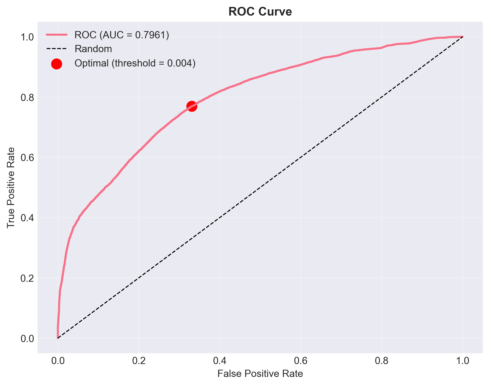
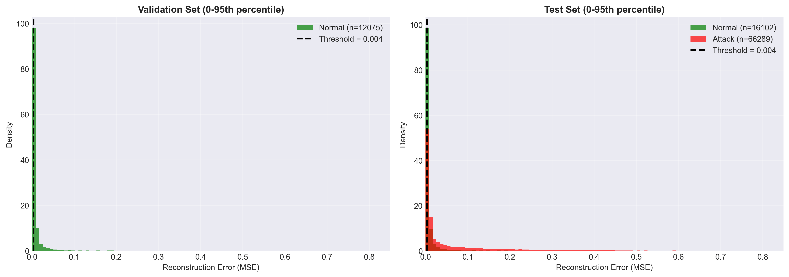
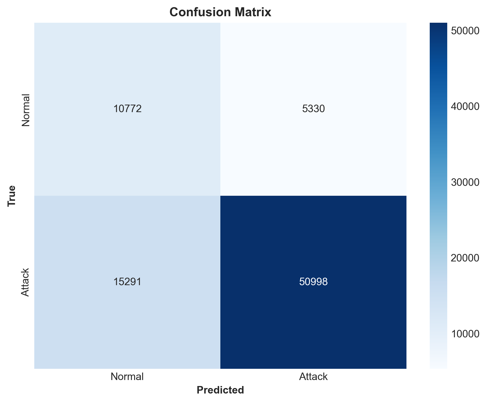

# Network Intrusion Anomaly Detection with Deep Autoencoders

Unsupervised anomaly detection on the UNSW-NB15 network traffic dataset using PyTorch. The autoencoder is trained on normal traffic only and uses reconstruction error to flag traffic patterns that deviate from normal behavior.

This is an applied ML study, not a production intrusion detection system. The goal is to demonstrate the full workflow: data cleaning, normal-only training, reconstruction-error scoring, threshold analysis, baseline comparison, and honest evaluation trade-offs.

---

## Results

Exploratory result from the original processed UNSW-NB15 notebook run:

| Model | ROC-AUC | Precision | Recall | FPR | Threshold |
| --- | ---: | ---: | ---: | ---: | ---: |
| Deep Autoencoder | 0.796 | 90.5% | 76.9% | 33.1% | 0.003722 |

Important interpretation notes:

- ROC-AUC is threshold-independent and is the most stable headline metric here.
- Precision, recall, and FPR depend on the selected operating threshold.
- The reusable evaluation script now selects the operating threshold from normal validation errors instead of tuning it on the mixed test set.
- The threshold-dependent metrics above should be regenerated after rerunning the updated evaluation script.
- The original false positive rate is high: about one in three normal samples is flagged at the reported operating point.

Result figures generated by the evaluation notebook:







---

## Why This Project?

Most intrusion detection systems rely on supervised learning: they need labeled examples of attacks during training. That creates a practical issue because new attack patterns can appear before labeled examples are available.

This project studies a complementary unsupervised approach: learn the structure of normal traffic, then use unusually high reconstruction error as an anomaly signal. This does not replace supervised intrusion detection, but it can be useful as an additional signal for unfamiliar or rare traffic patterns.

---

## Methodology

### Dataset

UNSW-NB15 is a network traffic dataset from UNSW Canberra.

- Original Kaggle parquet files: 175,341 training rows and 82,332 testing rows
- After duplicate removal and recombination used in the notebooks: 146,793 rows
- Final labels in the processed dataset: 80,504 normal rows and 66,289 attack rows
- Processed feature count: 33 features
- Attack categories in the original dataset: 9 categories, converted here to binary normal/attack labels

The dataset is available on Kaggle: [UNSW-NB15](https://www.kaggle.com/datasets/mrwellsdavid/unsw-nb15)

### Preprocessing

The preprocessing notebook:

1. Loads the original train/test parquet files.
2. Removes duplicate rows.
3. Drops `attack_cat` and ID-like columns from the model features.
4. Encodes categorical features (`proto`, `service`, `state`).
5. Standardizes features before training.
6. Creates a normal-only train/validation split and a mixed test split.

Final split used in the notebooks:

| Split | Normal | Attack | Purpose |
| --- | ---: | ---: | --- |
| Train | 52,327 | 0 | Autoencoder training |
| Validation | 12,075 | 0 | Normal-only threshold calibration |
| Test | 16,102 | 66,289 | Final anomaly evaluation |

### Model Architecture

The implemented model is a fully connected autoencoder:

```text
Input (33 features)
  -> 128 -> 64 -> 32 -> 16 -> 8 (bottleneck)
  -> 16 -> 32 -> 64 -> 128
  -> Output (33 reconstructed features)
```

Implementation details:

- PyTorch neural network
- ReLU activations on hidden layers
- BatchNorm on hidden layers
- Mean squared reconstruction error
- Adam optimizer with learning rate 0.001
- ReduceLROnPlateau scheduler
- Best checkpoint selected by normal-only validation loss

### Anomaly Scoring

For each sample, the anomaly score is the mean squared reconstruction error between the input and reconstructed output. Higher error means the sample is less similar to the normal traffic seen during training.

The current evaluation script selects the operating threshold from normal validation errors using a target validation false-positive rate. The mixed test set is then used once for final reporting.

### Baselines

The repository includes baseline scripts trained under the same normal-only protocol:

- Isolation Forest
- PCA reconstruction error

Both baselines calibrate their thresholds on normal validation scores and evaluate once on the mixed test set.

---

## Quick Start

1. Download the dataset from Kaggle and place the parquet files in `data/archive/`:

```text
data/archive/UNSW_NB15_training-set.parquet
data/archive/UNSW_NB15_testing-set.parquet
```

2. Install dependencies:

```bash
pip install -r requirements.txt
```

3. Run the notebooks in order:

```text
notebooks/01_data_exploration.ipynb
notebooks/02_preprocessing.ipynb
notebooks/03_model_training.ipynb
notebooks/04_evaluation.ipynb
```

4. Run validation-calibrated autoencoder evaluation from the repository root:

```bash
python src/evaluate.py --data_dir data/processed --model_path models/autoencoder.pth --results_dir results --target_fpr 0.05
```

5. Run baseline models from the repository root:

```bash
python src/baselines.py --data_dir data/processed --results_dir results --target_fpr 0.05
```

---

## Project Structure

```text
.
├── notebooks/              # Jupyter notebooks for the full workflow
├── src/                    # Reusable Python modules
│   ├── data_loader.py
│   ├── preprocessing.py
│   ├── model.py
│   ├── train.py
│   ├── evaluate.py
│   └── baselines.py
├── results/
│   └── figures/            # Saved evaluation figures
├── data/                   # Not committed; created locally after dataset download
├── models/                 # Not committed; created locally after training
├── requirements.txt
├── LICENSE
├── NOTICE
└── README.md
```

---

## What This Project Shows

- Building a normal-only anomaly detection pipeline.
- Handling duplicate samples and avoiding attack contamination in the validation set.
- Training a PyTorch autoencoder on tabular network traffic data.
- Evaluating anomaly detection with ROC-AUC, precision, recall, FPR, and confusion matrices.
- Calibrating thresholds on validation data instead of tuning them on the test set.
- Comparing the autoencoder against simple unsupervised baselines.
- Explaining the operational trade-off between recall and false positives.

---

## Current Limitations

This repository is credible as an applied ML experiment, but it still has limitations:

1. **Threshold target choice**: the evaluation script now avoids test-set threshold tuning, but the target validation FPR is still an operating assumption that should be justified for a real deployment.
2. **False positives**: the original reported 33.1% FPR is too high for direct operational deployment and should be regenerated under the updated validation-calibrated protocol.
3. **Categorical preprocessing**: categorical network fields are label-encoded. One-hot encoding or learned embeddings would be more methodologically sound.
4. **Baseline coverage**: the repo includes Isolation Forest and PCA reconstruction baselines, but does not yet include LOF, One-Class SVM, or supervised reference models.
5. **Dataset realism**: UNSW-NB15 is useful for benchmarking, but it is static and not a substitute for live traffic evaluation.
6. **No production layer**: there is no streaming inference service, alert triage UI, or deployment pipeline.

---

## Next Improvements

The highest-impact improvements would be:

1. Rerun the updated evaluation and baseline scripts, then replace the exploratory results table with validation-calibrated metrics.
2. Report recall at fixed FPR levels, such as 1%, 5%, and 10%.
3. Replace label encoding with a `ColumnTransformer` using `OneHotEncoder(handle_unknown="ignore")` for categorical features.
4. Add a single `scripts/run_experiment.py` command that regenerates preprocessing, training, evaluation, figures, and metrics.
5. Add tests for preprocessing, split integrity, model shape, and metric calculation.

---

## References

- Moustafa, N., & Slay, J. (2015). UNSW-NB15: a comprehensive data set for network intrusion detection systems. MilCIS 2015.
- UNSW-NB15 dataset on Kaggle: [UNSW-NB15](https://www.kaggle.com/datasets/mrwellsdavid/unsw-nb15)

---

## License

This project is licensed under the [Apache License, Version 2.0](LICENSE).

Copyright 2026 Benoit Vitiello.

---

## Contact

- GitHub: [@BenoitVitiello](https://github.com/BenoitVitiello)
- LinkedIn: [Benoit Vitiello](https://linkedin.com/in/benoit-vitiello)
